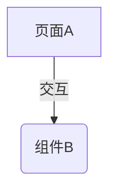

请根据当前图片生成模块文档，格式必须包含以下部分：

# [模块名]

## 模块概述
（简要描述该模块的核心功能和在系统中的作用，确保读者能快速理解模块主旨）

## 业务架构图 (Mermaid)
（使用 Mermaid 语法生成一个流程图或结构图，展示当前图片涉及的页面流转、核心组件关系或逻辑重点。请确保语法正确，例如：

）

## 组件结构
（详细列出 UI 元素）

## 业务逻辑
（详细描述交互、流程、行为）

## 数据接口
（输入输出字段、事件、状态变更）

请输出完整 Markdown 文档，不要添加与文档无关的解释。